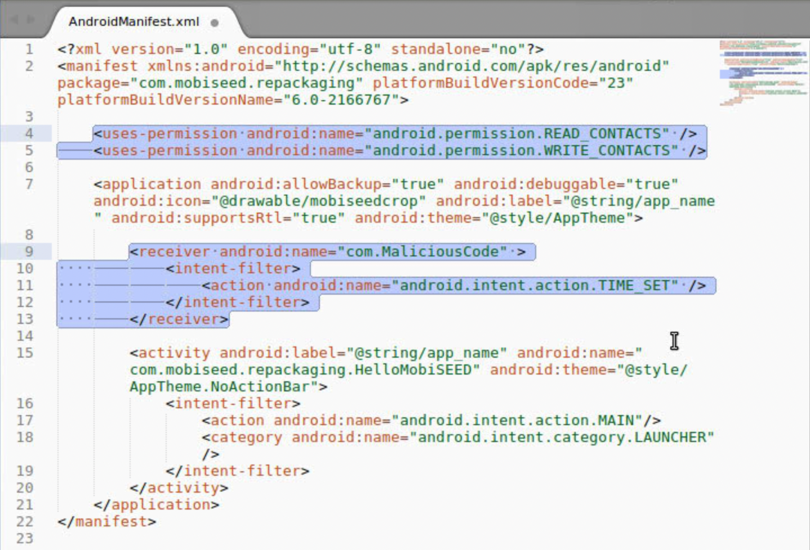
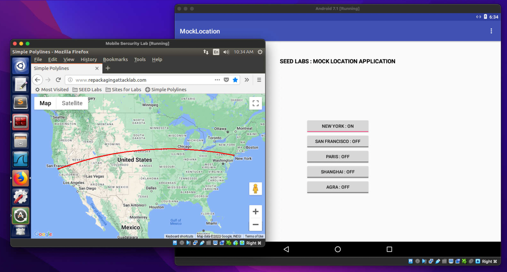

# Android Repackaging Attack

> Made with ♥ by Thomas Rüegg and Patrick Wissiak

# Introduction

In this exercise, we focus on understanding and executing an Android repackaging attack. A repackaging attack involves modifying a legitimate app to include malicious code and then redistributing the altered app. The goal of this exercise is to get hands-on experience with this type of attack, to understand the risks associated with downloading apps from untrusted sources and the vulnerabilities in Android's app packaging and distribution model. This exercise was strictly for educational purposes and should only be performed in a controlled lab environment.

## Tasks

1. Obtain an Android APK file and install it on the provided Android Virtual Machine (VM).
2. Use APKTool to disassemble the APK file and obtain its source code.
3. Inject malicious code into the disassembled app.
4. Repackage the app with the modified code and sign it with a custom certificate.
5. Install the repackaged app on the Android VM and test the success of the attack by triggering the malicious code.

## Warning

This exercise should only be conducted in a safe, controlled environment as described in this lab. Attempting this attack on actual devices or distributing repackaged apps to any app market can lead to severe legal consequences.

# Initial Setup

Both VMs have been
configured and downloaded from the SEEDLabs website. They are connected to the
same Network using the "NAT Network" adapter.

## Installing the App

To obtain the IP
address of the Android VM, we ran the `ifconfig` command in the Android
`Terminal Emulator` app.

Next, using this IP address, we installed
the supplied `RepackagingLab.apk` using the `adb` tool from the Ubuntu VM. 
We tried the Terminator Terminal for this (preinstalled on the SEED VM):

That actually worked, as we are now able to find the `Repackaging Lab` App on our Android VM.

# Delete Contacts Attack

## Disassemble the App

In order to modify the
app, we need to disassemble it first. An apk file is basically a zip file
containing multiple files for the app to run. We were able to disassemble it using
the following command:

A new folder appears
in the terminal's working directory, in our case the `/home` folder, which
contains the app's contents. There is also a file called apktool.yml, which is
not listed in the picture above. It appears that the file contains meta-information
about the apk.

## Inject Malicious Code

Now, it's time to
inject malicious code into the app. We do this by adding a component to the app
that runs independently, thus not changing the app's behavior. To do that, we
can add another Smali file. A Smali file is a human-readable representation of
Android application bytecode, derived from compiled DEX files in Android APKs.
Smali files use an assembly-like language, which allows us to analyze, debug,
and modify the application's code more easily.

To inject the code, we
placed the `MaliciousCode.smali` into the folder the APKTool made into `smali/com`.

We are not done yet as
we also need to tell the system when to invoke the broadcast receiver. We can
do this by adding information to the app's `AndroidManifest.xml` file. It can
be found in the root of the folder the APKTool created. As we want to read and
delete the contacts of the victim, an app needs to declare those permissions in
that manifest file.

The highlighted part
in the following figure is what we added to the file:

This will allow the
app to read and write the contacts and also hooks the broadcast receiver to the
`TIME_SET` event.

## Repack app

Now that we have
injected our malicious code and mapped it correctly, we are ready to repack the
Android App.

### Rebuild APK

Rebuilding can be done
using the APKTool again. We used the following command to do so:

The newly rebuilt app
is in the `dist` directory inside the `RepackagingLab` folder.

### Sign the APK file

To install apps on
Android, they need to be signed first. Therefore, each APK needs to have a
digital signature and a public key certificate. However, Android allows certificates
to be self-signed, which kind of defeats the purpose of a certificate and
signature, as third-party app markets do not always conduct a name verification
as Google Play Store does.

To sign the app, we generate a
public/private key pair as well as a self-signed certificate using the keytool
command:

Now that we created
the self-signed certificate, we can use it to sign the app with the `jarsigner`
command.

The app is now signed
and ready to be installed.

## Install the repackaged app

To install the
repackaged app on our Android VM, we need to uninstall the previously installed
`RepackagingLab` app. Otherwise, we would get a signature mismatch. Thus, we
drag the app from the App Library into the uninstall area and confirm this
prompt:

To install the app
with the malicious code, we applied the same procedure as before, using the
`adb` command:

## Trigger the Malicious Code

To make the attack
work, the app actually has to have access to the contacts. Usually, it would
ask for those permissions when a user installs the app. Because we installed it
via the `adb` command, these prompts do not appear, and we have to do it
manually. We went into Settings > Apps > RepackagingLab > Permissions > Contacts (toggle on).

As the attack will
delete all contacts, we first had to create some to see if it worked. Next, we
ran the app once (to register the receiver). As the malicious component gets
triggered by the `TIME_SET` event, we had to change the Android VM's time. After
doing that, all of the contacts were gone.

# Location Tracking Attack

In this task, we will
perform another repackaging attack where the malicious code will steal the
location information from a user’s phone, essentially tracking the user’s
movement.

## Configuring DNS

The code in the
repackaged app will need a DNS server to send the location data to. In a real
attack, we would host the "repackagingattacklab" service somewhere on
the internet and create a DNS entry to mitigate this step. But for the lab, we
configured the SEED Ubuntu VM to be that server. Therefore, we need to map the
hostname to the Ubuntu VM's IP address. To do that, we changed the
`/system/etc/hosts` file on the Android VM using the `adb` command on the
Ubuntu VM.

## Repackaging App

Using the same folders
that we had from the previous disassembling of the `RepackagingLab.apk`, we
placed the three files `MaliciousCode.smali`, `SendData$1.smali`, and `SendData.smali`
(downloaded from the SEED Lab) into the folder `/home/seed/RepackagingLab/smali/com/mobiseed/repackaging`.

Next to that, we need
to adjust the `AndroidManifest.xml` once more to configure the permissions. The
highlighted part is what we added:

The next step is again
to repackage, sign and install the app using the `adb` utility. Repackage:

Sign the app using the
same key pair and certificate as before:

Uninstall the currently
installed RepackagingLap app on the Android VM to evade a signature mismatch:

Install the newly signed
app on the device:

Again, it is also
needed to give the app permission to use the location on the Android VM itself.

Now we need to run the
app once to register the receiver. Again, the malicious component gets
triggered by the `TIME_SET` event. We changed the time of the Android VM, and
therefore triggered the attack.

## Setting up mock locations

As we run Android in a
VM, there is no location information from any GPS hardware. We ran the GPS
mocking app (preinstalled on our Android VM), which makes sure there is a
location to spy on in the first place and chose New York.

When visiting http://www.repackagingattacklab.com on our Ubuntu VM, we saw that the Android
device was in Paris at the moment:

[http://www.repackagingattacklab.com](http://www.repackagingattacklab.com)

In the Mocking App, we
set our location to any other location than Paris and checked the website on
the Ubuntu VM, where it would still always show up as Paris. Something went
wrong 🗿

After multiple times repackaging
the app, going over the whole manual over and over again, changing the `/etc/system/hosts`
file, pinging the Ubuntu VM from the Android VM's side, and fiddling with the
`AndroidManifest.xml`, we finally found the reason: The VM's resources were too
low. In Virtualbox, we increased RAM and video memory, which finally made the
attack work.

The next attack try
worked as follows:

Here we can see that
our victim is currently in San Francisco.

On our Android VM, we then
changed the location to New York, which was represented nicely on our Ubuntu VM
at http://www.repackagingattacklab.com.

It showed us the
updated location, neat! After trying various locations, it shows a trace of
where the victim went.

This shows that our
attack is successful, and we are able to track the victim's location.

# Lab Questions

## Why is the repackaging attack not much a risk in iOS devices?

### App Store Review Process

iOS devices are
protected from repackaging attacks due to Apple's strict app review process.
All iOS apps must pass through this process before being approved for
distribution on the App Store. The review process thoroughly checks each app
for any malicious code or security issues, making it difficult for attackers to
distribute repackaged apps through the official App Store.

### Code Signing

iOS apps have a unique
digital signature (code signing), that verifies the app's authenticity and
integrity, which is applied after the review process. This digital signature helps
to prevent repackaging attacks by ensuring that each app has not been modified.
If an attacker attempts to modify an iOS app, the app's code signature becomes
invalid, and the app will not run on a device.

The check of the signature
happens on the Secure Enclave which is a separate processor next to the main
processor. The Secure Enclave runs its own operating system and has only a
strict messaging implemented to the main processor. The processes on the main
processor do not have access to the data on the Secure Enclave which secures it
from modification.

### Limited App Installation Sources

iOS devices are set up
by default to only allow apps to be installed from the App Store. This
significantly reduces the likelihood of encountering repackaged apps, as users
are less likely to download apps from potentially risky sources. This approach
helps keep iOS devices secure and helps to prevent users from accidentally
installing malware or other malicious apps on their devices. Also, through the
review process of the App Store, malicious code can often be discovered before
publication of the app.

### Secure Boot Chain

Apple has implemented
a whole chain of security checks to prevent attackers to modify the signatures:

The first signature,
which is signed by Apple's root Certificate Authority, is implemented on the
hardware and is fixed. This signature is then used to check the signature of
the next level and so on. The only risk is that the lowest level of the Secure
Boot Chain gets compromised and the only solution to that is to buy new
hardware.

## If you were Google, what decisions you would make to reduce the attacking chances of repackaging attacks?

Essentially, the
Android platform (including Google Play Store) would need to become more like
the Apple platform in order to be better protected against repackaging attacks.
Below we list some implementations that would make sense and would not need a rework
of the whole Android platform.

### Code Signing

Android Apps should
also check for a reliable signature of the installed APKs instead of just
trusting every pseudo-signed installation file. But in the end, this would also
end up signing all apps with a certificate of Google which then would involve
an elaborate review process on Google's side in order to get an app signed. This
would also pose a downside because Android would lose some of its
"unrestricted-ness" and app publishers would certainly not be amused.

### Google Play Integrity API

Google Play offers an
API to check the integrity of a message coming from an app. From the Android documentation:

[Android documentation](https://developer.android.com/google/play/integrity)Call the Integrity
API at important moments in your app to check that user actions and requests
are coming from your unmodified app binary, installed by Google Play, running
on a genuine Android device. Your app’s backend server can decide what to
do next to prevent abuse, unauthorized access, and attacks.

The API call does not
really protect the target user from downloading a repackaged app, but it
enables the backend to check the integrity of "high value actions"
which could for example mitigate data leaks due to repackaged apps. The
downside is that developers have to specifically take actions and bugs are
still possible.

Below is the process
of a call to the Google Play Integrity API:

### Automatic integrity protection

Google already
directly offers a way to make it harder for attackers to publish repackaged
apps: automatic integrity protection. It helps guarding an app against modification,
making it harder to distribute unofficial copies with altered behavior.

From the Google documentation:

[Google documentation](https://support.google.com/googleplay/android-developer/answer/10183279)Automatic integrity
protection adds runtime checks to your app’s code to restrict
modification and redistribution, and then makes those checks hard to remove
with advanced obfuscation and anti-reverse engineering techniques. If the
installer check fails, users will be prompted to get your app on Google Play.
If the modification check fails, the app will not run. This helps to keep
users safe from harmful content that may appear in modified versions of your
app.

## Third-party markets are considered as the major source of repackaged applications. Do you think that using the official Google Play Store only can totally keep you away from the attacks? Why or why not?

Using only the
official Google Play Store does not totally prevent users from downloading repackaged
applications. First of all, the Google Play Store guidelines to publish an app
are not as thorough as Apple's. Secondly, as we have seen in the Lab, the
signature needed to sign an app is not really trustworthy.

Google tries to filter
out repackaged applications, but the risk is not fully mitigated. In the end,
the user still needs to be cautious with what permissions are granted to the
app. And if malicious behavior is detected, the user should report the app on
the Google Play Store so that Google can remove it from its store. A good
practice is to have a look on the rating and the comments before downloading an
app because they might already indicate that something is wrong with the
application.

## In real life, if you had to download applications from untrusted source, what would you do to ensure the security of your device?

An application from an
untrusted source should never be installed on a mobile device. If there is no
other way, the untrusted application should be downloaded to an isolated
sandbox environment. It is also important to monitor the behavior of the app so
that no unwanted actions (such as Bitcoin mining) are performed in the
background. The security of a device that has downloaded and installed an
application from untrusted sources, is not ensured anymore.

It is also
recommendable to scan the app with security software. This can be done via an
antivirus or mobile security app on the device and run a scan on the downloaded
APK file. The security software can detect any known malware or suspicious
behavior.

Also, the app from the
untrusted source should not be allowed to have any privilege that is not
immediately related to the purpose of the app. For example, if a music app
requests access to contacts with the reason to see what your friends are
listening, this should rather be disallowed.

## What is “Google Play Protect?” Could this be a solution to this problem?

Google Play Protect is
designed to ensure the safety of Android devices by performing two types of app
scans:

- during the installation process
- at periodic intervals

In case a potentially
harmful app is detected, Google Play Protect can take different actions such as
sending a notification to the user asking them to remove the app, disabling the
app until the user decides to remove it, or automatically removing the app.
Once the app has been removed, users will typically receive a notification
informing them of the action taken.

Google Play Protect is
not specifically designed to mitigate the risk of repackaging attacks but it
certainly reports apps that show malicious behavior which could also include
repackaged apps. But in the end, Google Play Protect is not the one and only solution
to mitigate repackaging attacks.

# Conclusion

We learned that Android
Repackaging attacks are serious threads and are very relevant.

Learning more about
mobile security was very interesting, as we never really thought about it. This
attestation made us realize the importance of mobile security.

Mobile security's
importance was confirmed once more to us as Apple recently pushed an update labeled
as 'rapid security response' for the first time, hinting they mitigated a serious
vulnerability in iOS (undisclosed, but it might be they found a zero-day
exploit).

